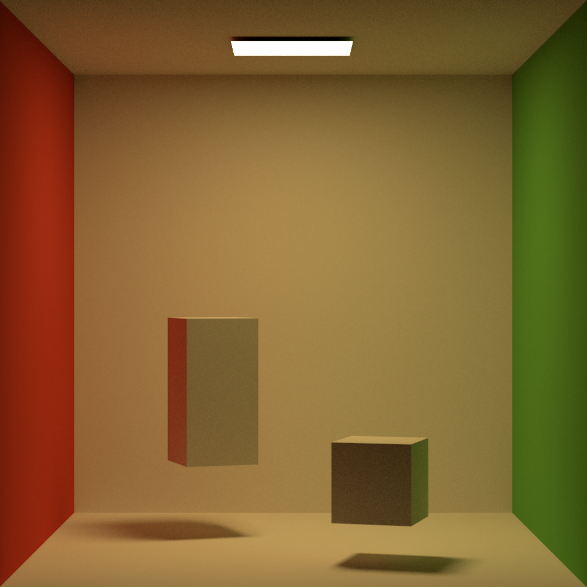

# 🌺Ajisai (WIP)

**A physically based renderer lab based on ray tracing**

## Features

### Integrators

* [x] Path Tracing with Multiple Importeance Sampling
* [ ] Bidirectional Path Tracing with Multiple Importance Sampling
* [ ] Multiplexed Metroplis Light Transport
* [ ] Vulumetric Path Tracing

### Materials

* [x] Lambertion Diffuse
* [ ] Disney principled BSDF
* [ ] Subsurface Scattering
* [ ] DreamWorks fabric
* [ ] Homogeneous/heterogeneous participating medium
* [ ] Normalized diffusion BSSRDF

### Acceleration Structure

* [x] Parallel Locally-Ordered Clustering for Bounding Volume Hierarchy Construction from [D. Meister and J. Bittner](https://meistdan.github.io/publications/ploc/paper.pdf)
* [x] [Embree](https://embree.github.io/) can be optionally used (Introduce external dependency)

### Light Source

* [ ] Point Light
* [x] Enviorment Light
* [x] Directional Light
* [ ] Polygonal Area Light
* [ ] Procedural Sky Light with Hosek Model
* [ ] HDR Probe

### Camera Models

* [x] Thin Lens Model
* [ ] Fisheye Camera
* [ ] Realistic Camera Parameters
* [ ] Arbitrarily Shaped Bokeh
* [ ] Vignette and Cateye effect

### Sampler

* [x] Independent Sampler
* [ ] Sobol Sequence

### Editor

* [ ] Interactive scene editor

## Gallery

Cornel Box (rendered with pt)

Dragon (rendered with pt)

Material-testball

